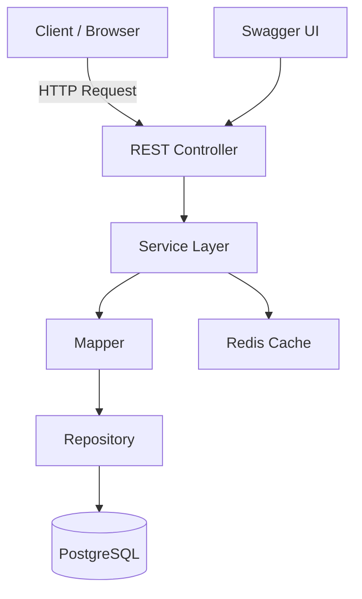
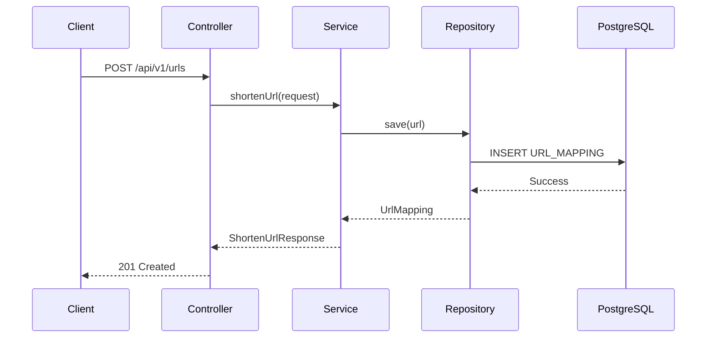
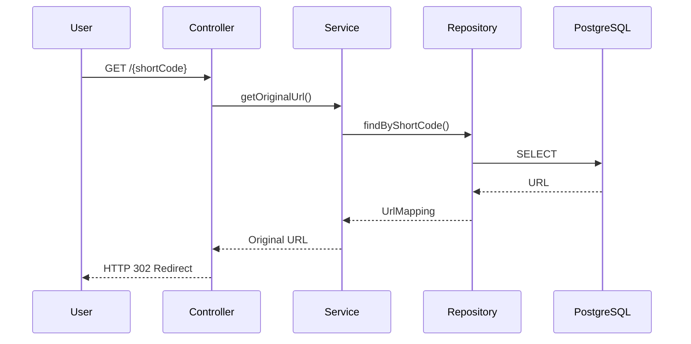
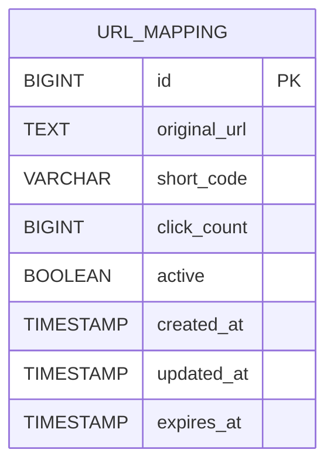
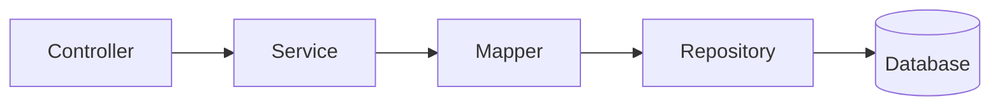

# 🚀 SmartURL

A production-ready URL Shortener built using **Java 21**, **Spring Boot**, **PostgreSQL**, and **Docker**.


---

## ✨ Features

- 🔗 Shorten long URLs
- 🚀 Redirect using unique short codes
- ⏳ URL Expiration Support
- 📊 Click tracking
- ✅ Input validation
- 🌍 RESTful APIs
- 📖 Interactive Swagger/OpenAPI documentation
- ⚡ Global exception handling
- 🗄 PostgreSQL persistence
- 🏗 Clean layered architecture
- 🐳 Docker & Docker Compose support

---

## 🛠 Tech Stack

| Category | Technology |
|----------|------------|
| Language | Java 21 |
| Framework | Spring Boot 3 |
| Database | PostgreSQL |
| ORM | Spring Data JPA / Hibernate |
| API Documentation | Swagger (OpenAPI) |
| Build Tool | Maven |
| Validation | Jakarta Validation |
| Containerization | Docker & Docker Compose |
| Testing | JUnit 5 |

---

## 📁 Project Structure

```
src
├── controller
├── service
├── repository
├── entity
├── dto
├── mapper
├── exception
├── util
├── config
└── constants
```

---

## 📌 API Endpoints

| Method | Endpoint | Description |
|---------|----------|-------------|
| POST | `/api/v1/urls` | Create a short URL |
| GET | `/api/v1/urls` | Get all URLs |
| GET | `/api/v1/urls/{shortCode}` | Redirect to original URL |

---

## ⏳ URL Expiration

URLs can optionally expire.

If `expiresAt` is omitted, the system automatically applies the default expiration period configured by the application.

Expired URLs:

- return **410 Gone**
- cannot be redirected
- are automatically deactivated by a scheduled background job

## 📦 Request Example

### Create Short URL

```http
POST /api/v1/urls
```

```json
{
    "url":"https://google.com",
    "expiresAt":"2027-12-31T23:59:59"
}
```

Response

```json
{
  "status":201,
  "success":true,
  "message":"Short URL created successfully.",
  "data":{
      "shortUrl":"http://localhost:8080/AbCd123",
      "shortCode":"AbCd123",
      "originalUrl":"https://google.com",
      "expiresAt":"2027-12-31T23:59:59"
  }
}
```

---

## ⚙️ Running Locally

### Clone Repository

```bash
git clone https://github.com/suyashsachan2304-lab/smarturl.git

cd smarturl
```

### Build

```bash
mvn clean package
```

### Run

```bash
mvn spring-boot:run
```

---

## 🐳 Run with Docker

Build and start all services

```bash
docker compose up --build
```

Application

```
http://localhost:8080
```

Swagger UI

```
http://localhost:8080/swagger-ui/index.html
```

---

## 🗄 Database

PostgreSQL is used as the primary datastore.

Entity:

- URL Mapping
- Short Code
- Original URL
- Click Count
- Created Timestamp
- Expiry Timestamp
- Active Status

---

## ❤️ Health Check
```
GET /actuator/health
```

```json
{
  "status": "UP"
}
```

## 🏛 Architecture



## 🔄 URL Shortening Flow



## 🔗 Redirect Flow



## 🗄 Database Schema



## 📁 Layered Architecture



---

## 🚧 Roadmap

- JWT Authentication
- User Management
- Custom Alias Support
- URL Expiration
- Redis Caching
- Kafka Click Analytics
- QR Code Generation
- Rate Limiting
- Prometheus & Grafana Monitoring
- GitHub Actions CI/CD
- Flyway Database Migrations
- Testcontainers Integration

---

## 👨‍💻 Author

**Suyash Sachan**

Backend Engineer | Java | Spring Boot | Microservices | Distributed Systems

---

## 📄 License

This project is licensed under the MIT License. See the `LICENSE` file for details.

---

## ⭐ Support

If you found this project useful, consider giving it a ⭐ on GitHub.

It helps others discover the project and motivates future improvements.