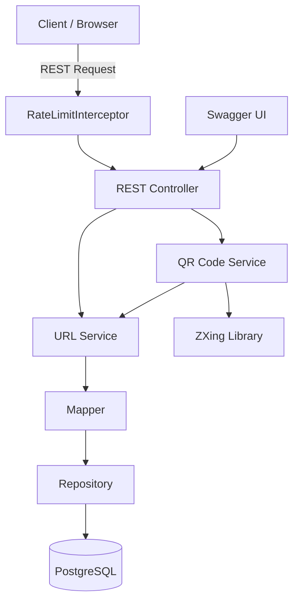
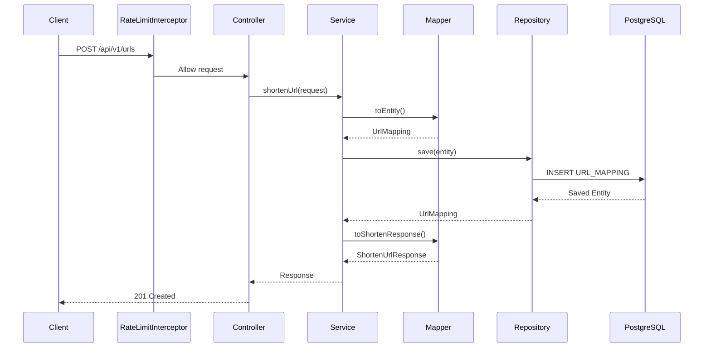
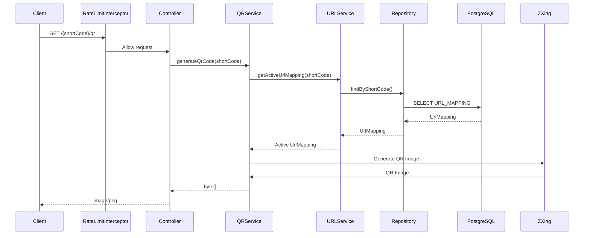
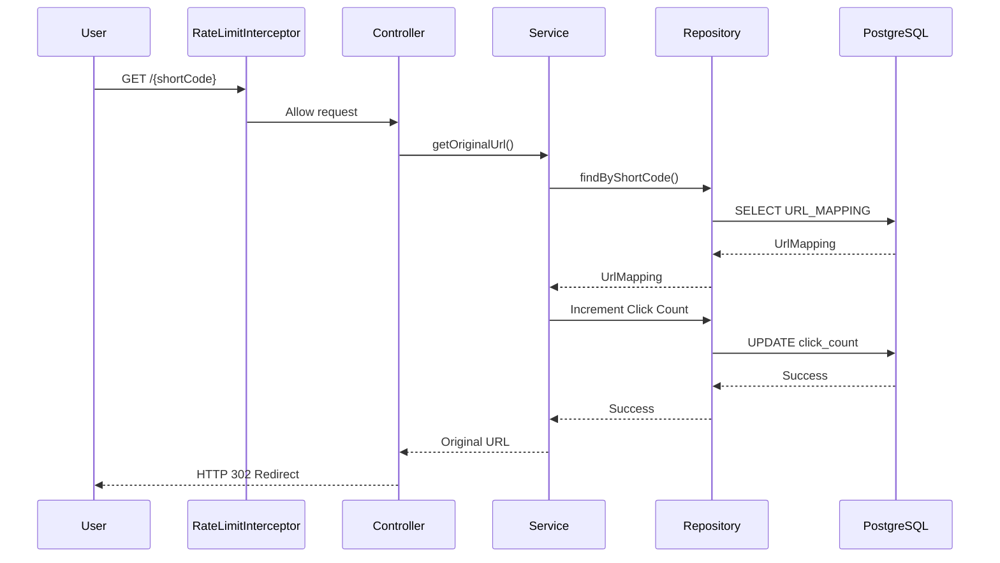
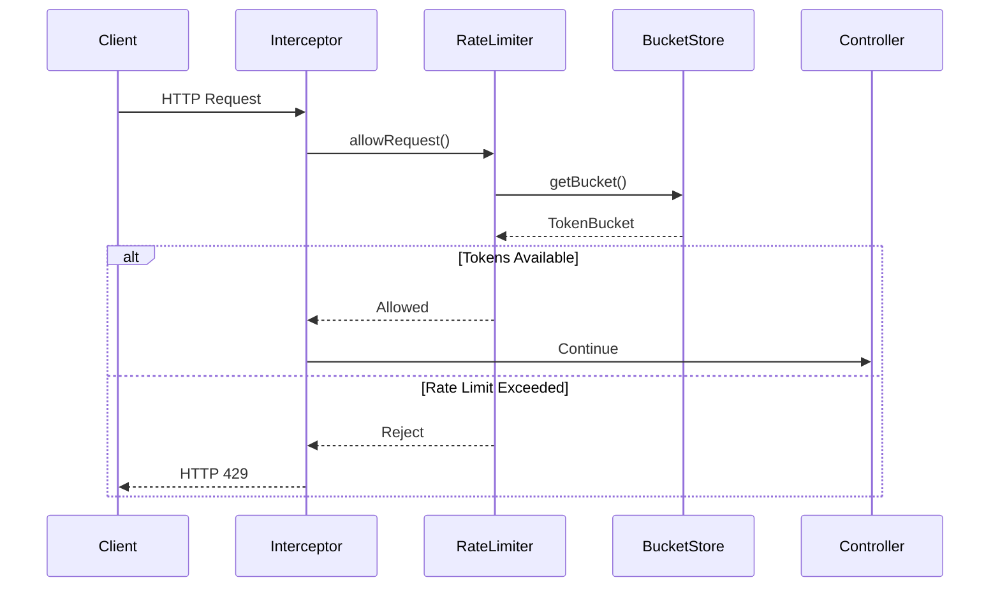
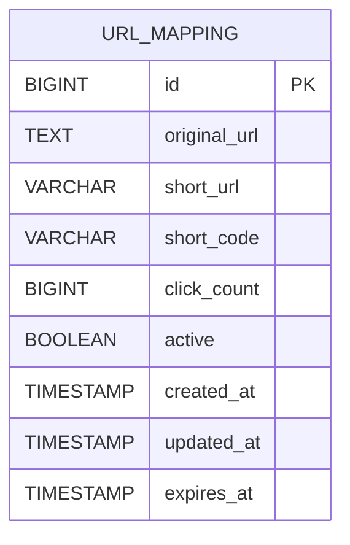
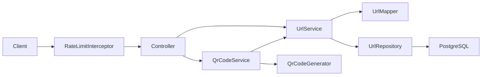

# 🚀 SmartURL

A production-ready URL Shortener built using **Java 21**, **Spring Boot**, **PostgreSQL**, and **Docker**.

SmartURL includes enterprise-grade capabilities such as configurable URL expiration, QR code generation, custom aliases, click analytics, and a thread-safe **Token Bucket Rate Limiter** for protecting APIs from abuse.


<!--  -->


[](https://github.com/suyashsachan2304-lab/smarturl/actions/workflows/build.yml)

---

## ✨ Features

- 🔗 Shorten long URLs
- 🚀 Redirect using unique short codes
- ⏳ URL Expiration Support
- 📊 Click tracking
- 🎯 Custom Alias Support
- 📱 QR Code Generation
- 🚦 Token Bucket Rate Limiting
- ✅ Input validation
- 🌍 RESTful APIs
- 📖 Interactive Swagger/OpenAPI documentation
- ⚡ Global exception handling
- 🗄 PostgreSQL persistence
- 🏗 Clean layered architecture
- 🐳 Docker & Docker Compose support

---

## 🛠 Tech Stack

| Category | Technology |
|----------|------------|
| Language | Java 21 |
| Framework | Spring Boot 3.5 |
| Database | PostgreSQL |
| ORM | Spring Data JPA / Hibernate |
| API Documentation | Swagger (OpenAPI) |
| Build Tool | Maven |
| Validation | Jakarta Validation |
| Containerization | Docker & Docker Compose |
| Testing | JUnit 5 |
| QR Code Generation | ZXing 3.5.3 |
| Concurrency | ConcurrentHashMap, AtomicLong, ReentrantLock |
| Rate Limiting | Token Bucket Algorithm |

---

## 💡 Design Decisions

- Layered Architecture
- Spring Data JPA
- Custom Alias Support
- Configurable URL Expiration
- Automatic QR Code Generation
- Token Bucket Rate Limiting
- Lazy Token Refill
- Thread-safe Request Processing
- Conventional Commit based releases
- Pull Request driven development

---

## 📁 Project Structure

```
src
├── common
├── config
├── constants
├── controller
├── dto
├── entity
├── exception
├── mapper
├── ratelimiter
├── repository
├── scheduler
├── service
└── util
```

---

## 📌 API Endpoints

| Method | Endpoint | Description |
|---------|----------|-------------|
| POST | `/api/v1/urls` | Create a short URL |
| GET | `/api/v1/urls` | Get all URLs |
| GET | `/api/v1/urls/{shortCode}` | Redirect to original URL |
| GET | `/api/v1/urls/{shortCode}/details` | Get URL Details |
| GET | `/api/v1/urls/{shortCode}/qr` | Generate QR Code |
| DELETE | `/api/v1/urls/{shortCode}` | Delete URL |

> **Note**
>
> Unless explicitly excluded through configuration (for example Swagger UI and health endpoints), all public APIs are protected by the built-in Token Bucket Rate Limiter.

---

## 📦 Request Example

### Create Short URL

```http
POST /api/v1/urls
```

```json
{
    "url":"https://google.com",
    "expiresAt":"2027-12-31T23:59:59",
    "customAlias":"google"
}
```

Response

```json
{
  "status":201,
  "success":true,
  "message":"Short URL created successfully.",
  "data":{
      "shortUrl":"http://localhost:8080/google",
      "shortCode":"google",
      "originalUrl":"https://google.com",
      "expiresAt":"2027-12-31T23:59:59"
  }
}
```

---

## 🚦 API Rate Limiting

SmartURL protects its APIs using a **Token Bucket Rate Limiter**.

### Features

- Configurable request limits
- Burst traffic support
- Thread-safe implementation
- Automatic token refill
- HTTP `429 Too Many Requests`
- `Retry-After` response header
- `X-RateLimit-Remaining` response header
- Automatic cleanup of inactive client buckets

The implementation uses the Token Bucket algorithm with lazy token refill, thread-safe bucket management, and configurable request limits. The design allows future migration to a distributed Redis-backed implementation without changing the public API.

For implementation details, see the documentation in the `docs/ratelimiter` directory.

---

### Rate Limiting Example

After the configured request limit is exceeded, the API responds with **HTTP 429 Too Many Requests**.

```http
POST /api/v1/urls
```

Response

```http
HTTP/1.1 429 Too Many Requests
Retry-After: 15
X-RateLimit-Remaining: 0
Content-Type: application/json
```

```json
{
  "status": 429,
  "success": false,
  "message": "Rate limit exceeded. Please try again after 15 seconds.",
  "timestamp": "2026-07-17T18:30:25Z"
}
```

Once the retry period has elapsed, requests are accepted again automatically.

```http
HTTP/1.1 201 Created

X-RateLimit-Remaining: 9
```

```json
{
  "status": 201,
  "success": true,
  "message": "Short URL created successfully.",
  "data": {
    "shortUrl": "http://localhost:8080/google",
    "shortCode": "google",
    "originalUrl": "https://google.com",
    "expiresAt": "2027-12-31T23:59:59"
  }
}
```

---

## ⏳ URL Expiration

URLs can optionally expire.

If `expiresAt` is omitted, the system automatically applies the default expiration period configured by the application.

Expired URLs:

- return **410 Gone**
- cannot be redirected
- are automatically deactivated by a scheduled background job

---

## 📱 Generate QR Code

### Display QR

```http
GET /api/v1/urls/google/qr
```

Returns

```
image/png
```

### Download QR

```http
GET /api/v1/urls/google/qr?download=true
```

Downloads

```
google.png
```

---

## ⚙️ Running Locally

## Prerequisites

- Java 21
- Maven 3.9+
- PostgreSQL 16
- Docker (optional)

### Clone Repository

```bash
git clone https://github.com/suyashsachan2304-lab/smarturl.git

cd smarturl
```

### Build

```bash
mvn clean package
```

### Run

```bash
mvn spring-boot:run
```

---

## 🐳 Run with Docker

Build and start all services

```bash
docker compose up --build
```

Application

```
http://localhost:8080
```

Swagger UI

```
http://localhost:8080/swagger-ui/index.html

```

OpenAPI Spec

```

http://localhost:8080/v3/api-docs

```

---

## 🗄 Database

PostgreSQL is used as the primary datastore.

Entity:

- URL Mapping
- Short Code
- Original URL
- Click Count
- Created Timestamp
- Expiry Timestamp
- Active Status

---

## ❤️ Health Check
```
GET /actuator/health
```

```json
{
  "status": "UP"
}
```

## 🏛 Architecture



## 🔄 URL Shortening Flow



## 📱 QR Code Flow



## 🔗 Redirect Flow



## 🚦 Rate Limiting Flow



## 🗄 Database Schema



## 📁 Layered Architecture



---

# 🚀 Automated Releases

SmartURL uses **GitHub Actions** together with **Release Please** to automate the release lifecycle.

Once changes are pushed to the `main` branch using **Conventional Commits**, the release process is automatically managed.

## 📦 Release Workflow

```text
Developer
    │
    ▼
Create Feature Branch
    │
    ▼
Implement Feature
    │
    ▼
Commit (Conventional Commit)
    │
    ▼
Push Feature Branch
    │
    ▼
Open Pull Request
    │
    ▼
GitHub Actions CI
    │
    ├── Maven Build
    ├── Unit Tests
    └── Docker Build
    │
    ▼
Merge Pull Request
    │
    ▼
Release Please
    │
    ├── Determine Next Version
    ├── Update CHANGELOG.md
    ├── Create Release Pull Request
    │
    ▼
Merge Release Pull Request
    │
    ▼
Automatic Git Tag
    │
    ▼
GitHub Release
    │
    ├── Generate Release Notes
    └── Upload Executable JAR
```

---

## ✍️ Conventional Commits

Release versioning is determined automatically from commit messages.

| Commit Type | Example | Version Bump |
|-------------|---------|--------------|
| **feat** | `feat: add Redis cache` | Minor (`x.y+1.0`) |
| **fix** | `fix: validate custom alias` | Patch (`x.y.z+1`) |
| **docs** | `docs: update README` | No Release |
| **refactor** | `refactor: simplify service layer` | No Release |
| **feat!** | `feat!: redesign API` | Major (`x+1.0.0`) |

---

## 🚀 Creating a Release

SmartURL follows a Pull Request based workflow.

```bash
git checkout -b feature/redis-cache

git add .

git commit -m "feat: add Redis caching"

git push -u origin feature/redis-cache
```

1. Open a Pull Request to the `main` branch.
2. Wait for GitHub Actions to complete successfully.
3. Merge the Pull Request.
4. Release Please automatically creates a Release Pull Request.
5. Merge the Release Pull Request to publish the new GitHub Release.

No manual versioning or Git tags are required.

---

## ⚙️ CI/CD Pipeline

Every push to the repository automatically triggers:

- ✅ Maven Build
- ✅ Unit Tests
- ✅ Docker Image Build
- ✅ GitHub Release Pipeline
- ✅ Artifact Upload

This ensures every published release is reproducible and built from validated source code.

---

## 🌿 Development Workflow

This repository follows a pull request based development workflow.

### Workflow

1. Create a feature branch

```bash
git checkout -b feature/<feature-name>
```

2. Commit using Conventional Commits

```bash
git commit -m "feat: add custom alias support"
```

3. Push the feature branch

```bash
git push -u origin feature/<feature-name>
```

4. Open a Pull Request to the `main` branch.

5. After the Pull Request is merged, Release Please automatically creates a release Pull Request containing the next semantic version and generated changelog.

6. Merge the release Pull Request to publish the new GitHub Release.

> **Note:** The `main` branch is protected. Direct pushes are not allowed and all changes must be merged through Pull Requests.

---

## 🚧 Roadmap

# API
- Retry
- Circuit Breaker

## Performance
- Redis Caching

# Analytics
- Kafka Click Analytics

# Security
- JWT Authentication
- User Management

# Operations
- Prometheus & Grafana
- Flyway
- Testcontainers

# Learning Roadmap

| Version | Focus Area |
|----------|------------|
| v1.0 | URL Shortening Fundamentals |
| v1.0 | URL Expiration |
| v1.1 | Custom Alias |
| v1.2 | QR Code Generation |
| v1.3 | Rate Limiting |
| v1.4 | Retry & Circuit Breaker |
| v1.5 | Redis Caching |
| v1.6 | Kafka Analytics |
| v1.7 | JWT Authentication |
| v1.8 | Observability |
| v2.0 | High Availability & Scalability |

---

## 👨‍💻 Author

**Suyash Sachan**

Backend Engineer | Java | Spring Boot | Microservices | Distributed Systems

---

## 📄 License

This project is licensed under the MIT License. See the `LICENSE` file for details.

---

## ⭐ Support

If you found this project useful, consider giving it a ⭐ on GitHub.

It helps others discover the project and motivates future improvements.